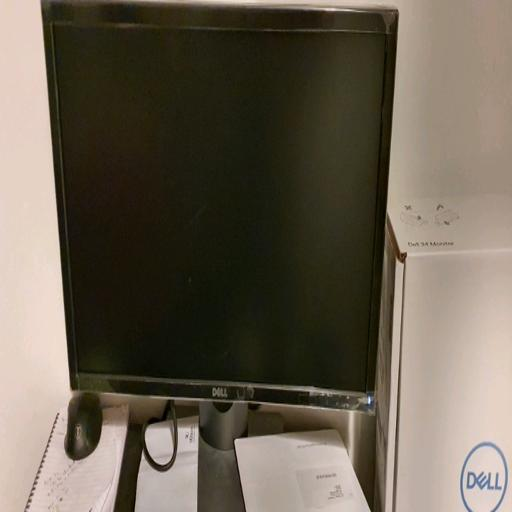
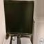
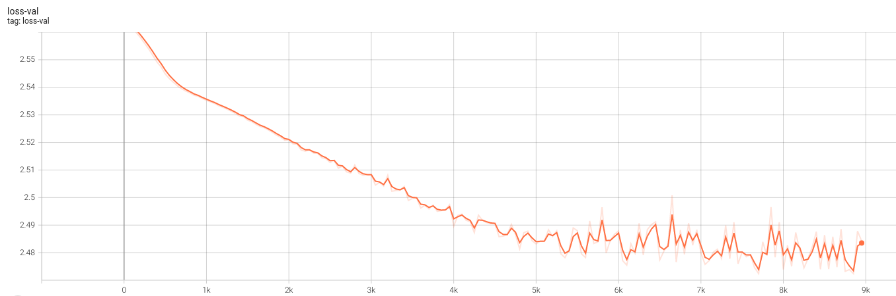
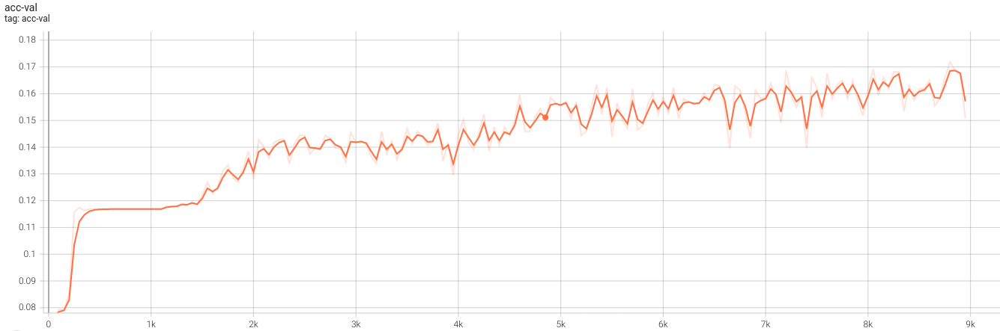
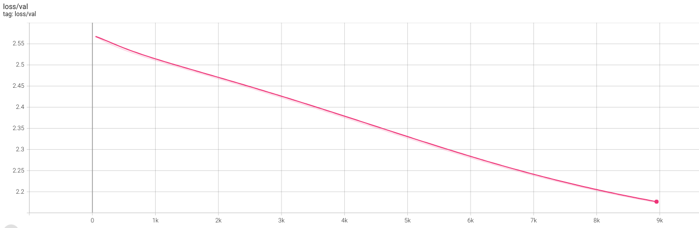
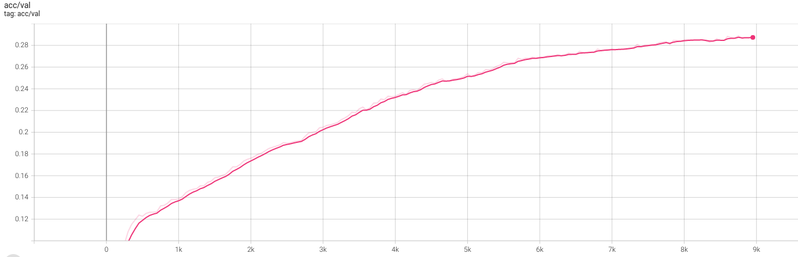

# Facebook Marketplace Recommendation Ranking System

> A project to develop and train a Facebook Marketplace Search Ranking system which uses is a trained multimodal model accepting both text and image data in order to generate vector embeddings in order to make recommendations for a user searching for a product to buy.

## Cleaning the dataset

Cleaning the tabular data which has been scrapped from Facebook, with information regarding:
 - Product Name
 - Product Description
 - Product Category
 - Product Price
 - Location of the seller

 Cleaning the images by converting them all to 3-channel RGB and two sizes: (512x512) and (64x64).

**Original**             | **Cleaned (512x512)**   | **Cleaned (64x64)**
-------------------------|-------------------------|-------------------------
  | | 

## Create vision datasets and dataloaders 

 - Cleaned the Product Category to classify each image into one of the following categories:
    - Appliances
    - Baby & Kids Stuff
    - Clothes, Footwear & Accessories
    - Computers & Software
    - DIY Tools & Materials
    - Health & Beauty
    - Home & Garden
    - Music, Films, Books & Games
    - Office Furniture & Equipment
    - Other Goods
    - Phones, Mobile Phones & Telecoms
    - Sports, Leisure & Travel
    - Video Games & Consoles
- Used the 64x64 images to create stratified training, validation and test dataloaders

## Create a vision model
 
 - Created and trained a CNN model with:
    - 2 Convolutional layers
    - 3 Fully Connected Linear layers

**Validation Log Loss**  |     
-------------------------|-------------------------
**Validation Accuracy** |

## Transfer learning (ResNet-50)

 - Used transfer learnining with a pre-trained ResNet-50 model to train a new Fully Connected Linear layer
 - Performance was much better than with the previous neural network
 - Model hadn't fully converged during training, so such be trained for longer

 **Validation Log Loss**  |     
-------------------------|-------------------------
**Validation Accuracy** |

- Created a feature extraction model by removing the final linear layer of the network
- Evaluated the final metrics of both model on the test set
    - First CNN Model:
        - Log-Loss: 2.46
        - Accuracy: 16.6%
    - ResNet-50 Model:
        - Log-Loss: 2.17
        - Accuracy: 30.4%
- Created an image processor script which predicts the category of a given image